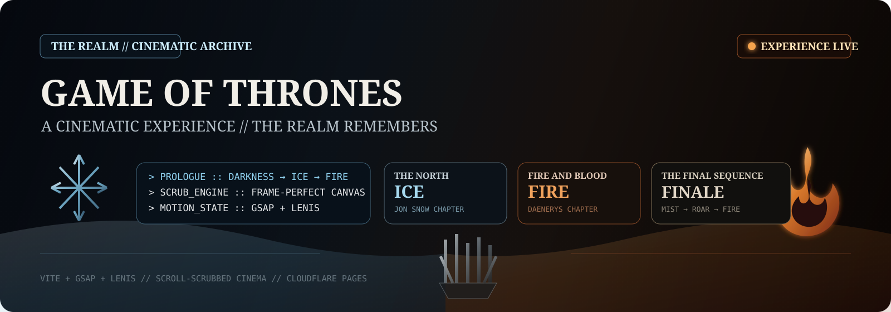
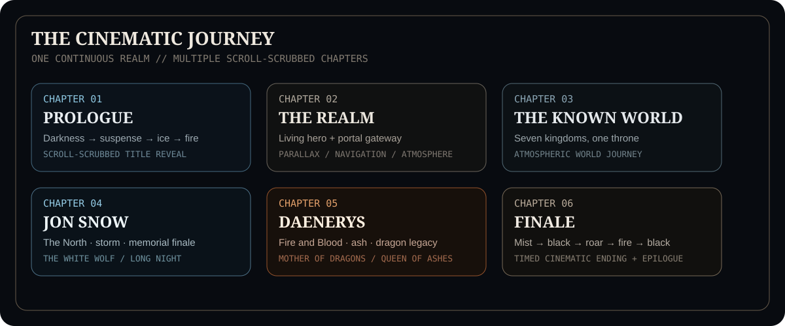

<p align="center">
  
</p>

<p align="center">
  <a href="https://got-experience.pages.dev/">
    
  </a>
  
  
  
</p>

> A premium, scroll-driven cinematic website inspired by the world of **Game of Thrones**. Darkness gives way to ice and fire, a living realm opens through a portal, the journey crosses the Known World, and dedicated Jon Snow and Daenerys chapters lead into a timed cinematic finale.

<p align="center">
  
</p>

## ⚔ THE REALM // EXPERIENCE

This project is structured as a sequence of cinematic chapters rather than a conventional landing page. The pacing, story moments and navigation are driven from a central site configuration, while the rendering layer handles atmosphere, scroll scrubbing and device-aware performance.

<p align="center">
  
</p>

### The journey

- **Prologue** — darkness → suspense → fire & shadow → scroll-scrubbed title reveal
- **The Realm** — living hero section with a cinematic portal transition
- **The Known World** — atmospheric scroll journey from the Wall to the Narrow Sea
- **Jon Snow** — The North, Night's Watch, storms and a memorial-style character finale
- **Daenerys Targaryen** — fire, exile, dragons, conquest and a fire-themed character finale
- **Finale** — mist → title → black → roar → fire → black
- **Epilogue** — ambient film, farewell line and quiet cinematic footer

<p align="center">
  
</p>

## ⚙ TECHNICAL ARCHIVE

The technical documentation below is preserved for development, asset replacement and deployment.

## Run it

```bash
npm install
npm run dev      # optimizes assets, then starts the dev server
npm run build    # production build into dist/
```

Requires [Node 18+](https://nodejs.org). [ffmpeg](https://ffmpeg.org) is
strongly recommended (`winget install Gyan.FFmpeg`) — it powers the automatic
asset optimization.

## Replacing assets — no code changes, ever

Drop files into these folders and reload (the dev server re-optimizes and
reloads automatically):

| Folder | What it drives | Notes |
| --- | --- | --- |
| `assets/intro/` | The scroll-scrubbed title reveal video | Any format — `.mov`, ProRes, HEVC, `.mp4`… it is transcoded to a web-safe, scrub-friendly MP4 automatically |
| `assets/world/` | The scroll-scrubbed World Introduction video | Same treatment as the intro; the chapter runs as pure atmosphere until a video arrives |
| `assets/jon/` | The Jon Snow chapter video | Scroll-scrubbed with story moments, storm effects and the memorial finale |
| `assets/dany/` | The Daenerys chapter video | Fire-themed twin of the Jon chapter; letterbox bars in uploads are trimmed automatically |
| `assets/ending/` | The finale backdrop, plus optional `dragon.*` video and roar audio | A timed movie ending: title from the mist → black → roar → fire → black |
| `assets/epilogue/` | The cinematic footer's ambient film | Muted loop beneath the farewell title and the quiet footer bar |
| `assets/logo/` | Nav logo | `.svg` preferred; falls back to an elegant text wordmark when empty |
| `assets/hero/` | Hero background layers | Multiple images become parallax planes (alphabetical order, first = deepest) |
| `assets/ui/` | Named UI artwork | e.g. `dragon.png`/`dragon.svg` replaces the built-in dragon silhouette |
| `assets/audio/` | Ambient loop | Presence of a file enables the sound toggle in the nav |

Files prefixed with `_` are treated as samples and lose to any other file in
the same folder. `assets/.web/` is generated output — never edit it.

<p align="center">
  
</p>

## Where things live

```text
assets/                 your media (see table above)
assets/.web/            auto-generated optimized derivatives + manifest
scripts/prepare-assets.mjs   the optimization pipeline (ffmpeg)
src/
  config/site.config.js      all copy, nav items, pacing — edit freely
  core/                      asset discovery · device tiers · smooth scroll
  fx/                        atmosphere: state, particles, fog, dragon
  scrub/                     the scroll-scrubbed video engine
  cinematic/timeline.js      the master scene choreography
  hero/                      hero section + navigation
  styles/                    design tokens + component styles
```

## Design notes

- **Choreography** lives in `src/cinematic/timeline.js` — it only writes
  values (to the shared `atmo` state, CSS variables, and the scrub target).
  Rendering happens in `src/fx/atmosphere.js` and `src/scrub/scrubber.js`.
  Scene timings are fractions of the prologue scroll, configurable in
  `site.config.js`.
- **Performance**: one shared rAF (GSAP ticker), pre-baked particle sprites,
  DPR caps and density tiers per device (`src/core/quality.js`), GPU-only
  CSS animation (transform/opacity), frame-blob LRU so video scrubbing uses
  flat memory. `prefers-reduced-motion` gets a calm, static-friendly cut.
- **Scrubbing**: the video is converted to frames at runtime
  (coarse-to-fine, so it is scrubbable within seconds) and drawn to canvas —
  frame-perfect forward *and* backward, no flicker, no black flashes.

<p align="center">
  
</p>

## ✦ Deployment — Cloudflare Pages

This is a static Vite build (`npm run build` → `dist/`) — no server runtime
is required, so it deploys to Cloudflare Pages as static assets.

### ⚠ Git LFS — read this first

`assets/**/*.mov` and `assets/.web/**/*.mp4` are tracked with **Git LFS**
(see `.gitattributes`). Two ways of getting the code will leave you with
LFS *pointer files* (small text stubs, not real video) instead of the
actual media:

- **GitHub's "Download ZIP" button** never resolves LFS content.
- Cloudflare Pages' own Git-integration clone has a known history of
  cloning repos **without** pulling LFS objects, which fails the build (or
  silently ships pointer text as your "video").

Before deploying, confirm you have the real files:

```bash
git lfs install
git clone https://github.com/<you>/GoT.git
cd GoT
git lfs pull                 # fetches the actual .mov / .web/*.mp4 files
ls -lh assets/.web/*/*.mp4   # should be several MB each, not ~130 bytes
```

If a file is only ~130 bytes and starts with `version https://git-lfs...`,
it's still a pointer — LFS wasn't resolved.

### Cloudflare Pages settings

- **Framework preset:** None (or Vite)
- **Production branch:** `main`
- **Build command:** `npm run build`
- **Build output directory:** `dist`
- **Root directory:** `/`
- **Node.js version:** 20 (pinned via `.nvmrc`; Node 18+ required)
- **Environment variables:** none required

`npm run build` runs `npm run assets && vite build`. The asset pipeline
(`scripts/prepare-assets.mjs`) needs `ffmpeg`/`ffprobe` only when it has new
or changed source media to transcode — if `ffmpeg` isn't installed in the
build image, it logs a warning and safely skips, reusing whatever is
already committed in `assets/.web/`. Since Cloudflare's build image is not
guaranteed to include `ffmpeg`, always commit fully-processed
`assets/.web/` output (as this repo already does) rather than relying on
the build step to transcode from scratch.

### Recommended: direct upload with Wrangler (avoids the LFS clone risk entirely)

Because this path builds locally — where you control whether LFS actually
resolved — it sidesteps any uncertainty about how Cloudflare's Git
integration handles LFS:

```bash
git lfs pull        # make sure real media is present, see above
npm ci
npm run build        # generates ./dist with real media baked in
npx wrangler login    # first time only
npx wrangler pages deploy dist --project-name=got-experience
```

`wrangler.toml` in this repo already pins the project name and output
directory, so subsequent deploys are just:

```bash
npm run build && npx wrangler pages deploy dist
```

### Git-based deployment (auto-deploy on push)

1. Push this project to GitHub/GitLab with LFS content intact (`git lfs
   push --all origin main` if it wasn't already tracked when you pushed).
2. In Cloudflare: **Workers & Pages → Create application → Pages → Import
   an existing Git repository**.
3. Select the repository and use the settings above.
4. Deploy, then check the build log's "Cloning git repository" step — if
   videos come out broken on the live site, re-check the LFS pointer issue
   above and fall back to the Wrangler direct-upload method.

### `_headers`

`public/_headers` sets a one-week cache on the cinematic video/image
assets; Vite copies everything in `public/` into `dist/` untouched, and
Cloudflare Pages reads `_headers` from the output root automatically.

<p align="center">
  
</p>

## ✦ CREDITS // PROJECT

<p align="center">
  <strong>Built by Creatary Labs</strong><br />
  <sub>Interactive cinematic web experiment · 2026</sub>
</p>

## ☽ SYSTEM NOTICE // FAN PROJECT

> This is an **unofficial, non-commercial Game of Thrones-inspired fan project** created as a cinematic front-end and motion-design experiment. Game of Thrones and related names, characters and marks belong to their respective rights holders. This project is not affiliated with or endorsed by HBO or the official franchise rights holders.

<p align="center">
  <strong>THE REALM REMEMBERS</strong><br />
  <sub>Built as a cinematic web experiment · Deployed on Cloudflare Pages</sub>
</p>
